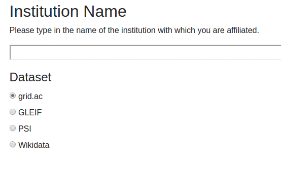
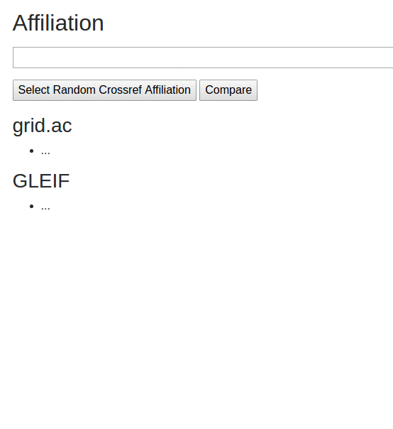
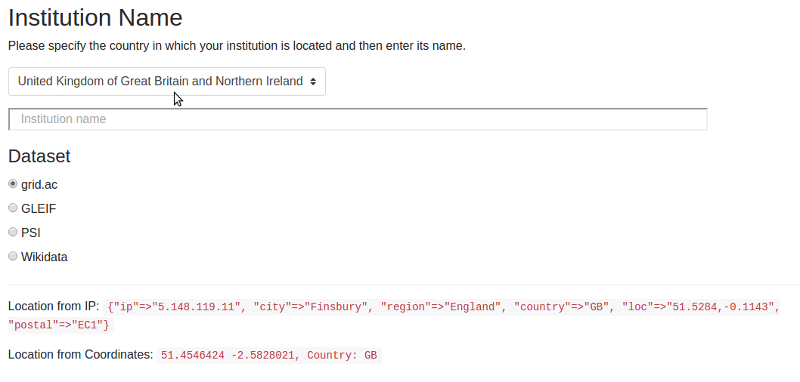

# Manual Dataset Testing

To facilitate some manual testing of the dataset, and exploration of some ideas around how to build a useful interactive 
widget, a simple web application has been provided.

Currently the application provides:

* A simple autocomplete widget that can be tested against any of the datasets
* A comparison page allowing the results of a single search to be compared across all datasets

## Running the application

From the main project directory:

```
rackup
```

Will launch the application at [`http://localhost:9292/`](http://localhost:9292/).

For development use `shotgun` which allows dynamica reloading of code. And point your 
browser at [`http://localhost:9393/`](http://localhost:9393/).

By default the application will talk to an Elastic Search instance at `http://localhost:9200` which is the default 
port.

To use an alternate location set the `ELASTIC_SEARCH` environment variable.

The application reads the dataset configuration file from `config/datasets.json`. This works automatically if you're 
running the application from the project directory.

You can specify a path to the configuration file instead using the `DATASET_CONFIG` environment variable.

## Features

The simple widget uses Twitter [typeahead.js](https://github.com/twitter/typeahead.js) to create a simple autocomplete 
feature similar to [the Fundref widget](https://github.com/CrossRef/fundref-widget)



The comparison page allows a single affiliation to be matched against all datasets. It's provided to allow comparison 
of ranking, etc.

User can type in some affiliation text or retrieve a random affiliation from the CrossRef API



## Locating a user

There are various scenarios in which a user may need to add affiliation details. For example when registering for 
a new service, providing institutional details for a manuscript submission, or updating an ORCID profile.

The common case will be that the user is in the same country as the institution, even if they're not actually on 
the premises. 

Users may of course add affiliations from different countries, e.g. when adding historical data or adding 
details of a remote working arrangement. But this is likely to be much less common.

Knowing the country in which an institution is located, will help narrow down the search for the right institution 
in the OrgId dataset.

So what options are there to help lookup a user's current country?

They are:

* automatically lookup their country based on their IP address, e.g. using [IpInfo](http://ipinfo.io/) or [HostIp](http://www.hostip.info/) 
  (although their API appears to be no longer available)

* lookup country based on geolocating the user from their browser and then using those co-ordinates to 
  determine the user's country, e.g. using the [Geonames API](http://www.geonames.org/export/web-services.html#countrycode)

* explicitly ask the user for the country information, using form field

A combination of processes could be used, e.g. defaulting a country form field based on one of the other two methods.
Performing geolocation within the browser is the most intrusive option as it involves a permission step. But has the potential 
to give the most accurate co-ordinates. Whether that's important or not remains to be seen.

The "Location based institution lookup" demo uses this approach. The user is prompted for the country in which the 
institution is located. The value of the selection is driven by their current IP address and, if permitted, refined 
based on their actual location. The user is free to change this option if its not correct.

